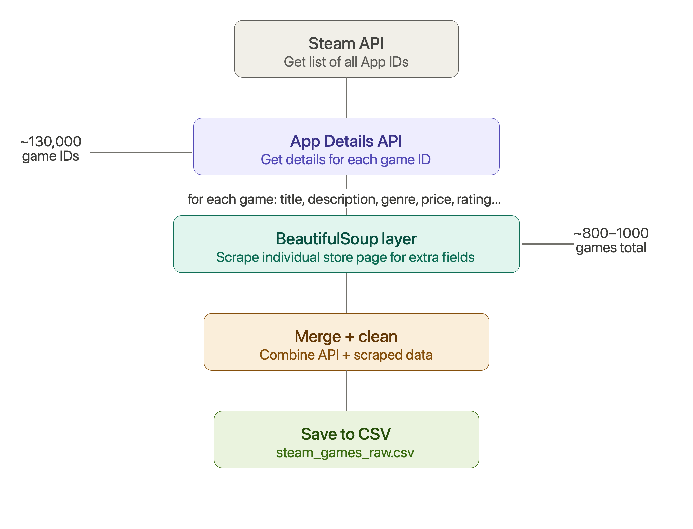

# Steam Recommender System

## Project Architecture Flowchart

## 📦 Project Libraries & Tools Breakdown

| Library | What it does | Why you need it |
| :--- | :--- | :--- |
| **`requests`** | Makes HTTP requests — like your browser visiting a URL, but in Python | To call the Steam API |
| **`beautifulsoup4`** | Reads HTML and lets you find specific parts of it | To scrape individual Steam pages |
| **`pandas`** | Handles tables of data (like Excel but in Python) | To store and manipulate your game data |
| **`numpy`** | Math library for numbers and arrays | For embeddings and similarity math |
| **`scikit-learn`** | Machine learning toolkit | For cosine similarity, evaluation |
| **`sentence-transformers`** | Pre-trained language model that converts text to vectors | For game description embeddings |
| **`optuna`** | Automatically finds best hyperparameters | For tuning your recommender |
| **`wandb`** | Experiment tracking dashboard | For logging results |
| **`streamlit`** | Builds web apps with pure Python | For your frontend |
| **`tqdm`** | Shows a progress bar in terminal | So you can see scraping progress |

# Steam Recommender System — Day 1: Getting the Data

This is the first step of our project. Our main goal today is to gather all the game information we need from Steam and save it safely onto our computer.

---

## 💡 Our Strategy: The "Hybrid" Approach

To get the best data possible while proving our coding skills to our professor, we are using two different methods at the exact same time:

### 1. The Core Data (Steam's Official API)
* **What it does:** Instead of trying to read Steam's main search website—which is built using JavaScript and often comes up completely empty—we talk directly to Steam's internal data system (the API). 
* **What we get:** This cleanly hands us all the main facts about a game without any website layout issues.
* **Fields captured:** Game Title, unique ID, Price, Main Genres, Developers, and if it works on Mac.

### 2. The Bonus Data (BeautifulSoup Web Scraping)
* **What it does:** Steam's official system leaves out some really cool details. To fix this, our script takes the Game ID and goes straight to that specific game's public store page to scrape the missing pieces using BeautifulSoup.
* **What we get:** This gives us the deeper context needed to build a great recommendation system.
* **Fields captured:** Community User Tags (like "Difficult" or "Atmospheric") and Player Reviews (like "Very Positive").

---

## 📊 How the Data Flows (Step-by-Step)

1. **Start:** We give our script a list of game IDs we want to look up.
2. **Step A (The API):** The script asks Steam's backend for the main details (Title, Price, Developer).
   * *Safe Guard:* If Steam tells us we are asking too fast, the script automatically pauses for 10 seconds to cool down.
3. **Step B (The Scraper):** The script opens the game's actual webpage in the background to grab the player tags and review scores using BeautifulSoup.
4. **Step C (The Merge):** The script glues both pieces of data together into a single game profile.
5. **Step D (The Backup):** The script saves a raw backup file of that game instantly, just in case our laptop battery dies or the internet drops.
6. **Step E (The Pause):** The script takes a short 1.5-second nap so Steam doesn't mistake us for a malicious spam bot.
7. **Finish:** Once all games are checked, it organizes everything into a clean spreadsheet file called `steam_games.csv`.

---

## 🛠️ Smart Features Built Into Our Code

I didn't just write a basic loop. We built this script to handle real-world problems:
* **Being a Good Internet Citizen:** By pausing for 1.5 seconds between games, I stay within Steam's rules and prevent our IP address from getting banned.
* **No Lost Progress:** Because it saves games one by one into the `/data/raw/` folder, I can stop the script at any time and we won't lose our data.

